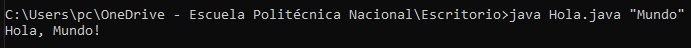

## Explicacion del método main

Cuándo comenzamos a programar en Java vemos una cadena como esta en el inicio:

``` java
public static void main (String[] args){

}
```

#### ¿Qué significa todo esto?

1. **`public`**: Es un modificador de acceso, en este caso al ser `public` cualquier **clase** o **paquete** puede acceder a este método.
2. **`static`**: Significa que no es necesario crear una **instancia** de la clase para acceder al método.
3. **`void`**: El método no retornará ningún valor.
4. **`main (String[] args)`**: Tenemos un array de objetos de dicha clase, es decir, Java hace esto ya que el usuario puede pasar parámetros extra desde la línea de comandos.

Un ejemplo:

``` java
public static void main (String[] args){
	String nombre = args[0];  
	System.out.println("Hola, " + nombre + "!"); 
} 
```

