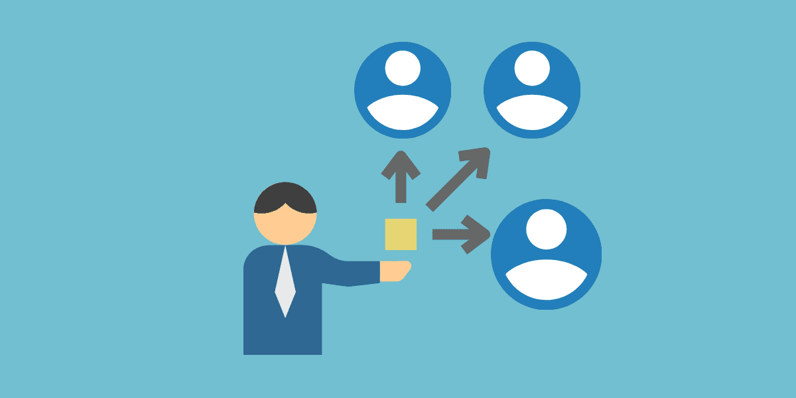
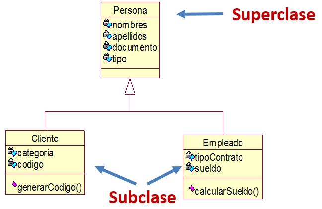

## Herencia

El concepto de herencia es similar a la vida real, es decir, pasamos nuestros "**bienes**" a uno o varios sucesores.

En programación se heredan los **atributos** y **métodos**. La clase de la que heredamos se conoce como **Superclase** y las que heredan son conocidas como **Subclases**.

